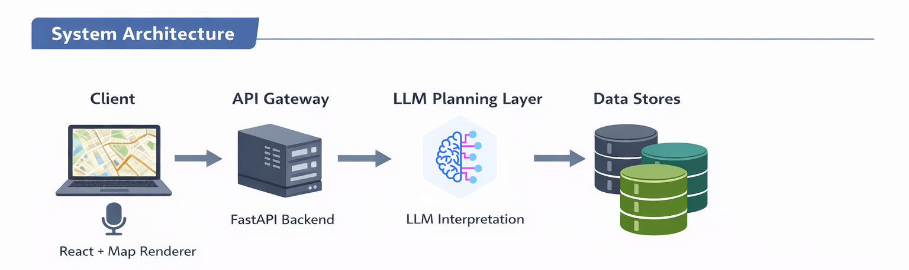
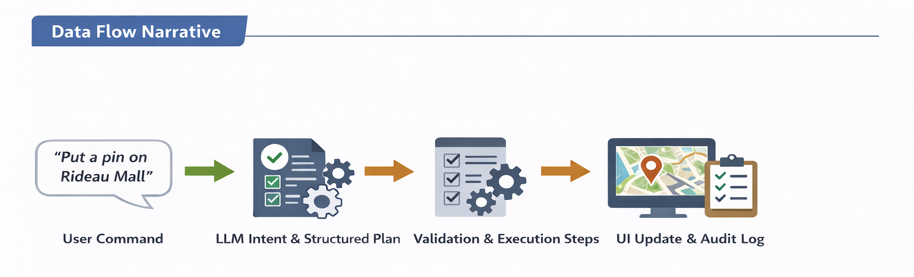

# URSA (Urban Reasoning & Spatial Analysis)

URSA (Urban Reasoning & Spatial Analysis) is a natural-language, map-based spatial analysis assistant built on open urban data. The system allows users to explore assets, overlays, and events by issuing typed that are translated into deterministic and auditable map interactions and filters.

Video Demonstration
- https://drive.google.com/file/d/1qDJixt4-rNbCNZ9ZRUQS2r26Nnmi27tv/view?usp=sharing
---

## Project Submission

### 1. Introduction

- **Problem statement:** Provide a user-friendly, LLM-augmented map interface that can interpret natural-language commands, manage ambiguity, and execute multi-step spatial actions across assets and overlays.
- **Target users & use cases:** Urban planners, operations teams, and analysts who need to query assets and overlay data (e.g., “Find the closest pharmacy to my location,” “show me my pinned locations”).

URSA prioritizes deterministic execution, audit history, and user-approved actions rather than free-form AI manipulation of the map.

---

### 2. Architecture Overview

- **High-level diagram:**
  - Client (React + map renderer) → FastAPI backend → LLM planning & interpretation layer → data stores (assets, overlays, events)

- **Component responsibilities:**
  - **Client:** user input, map rendering, viewport state, and UX flows for ambiguity resolution.
  - **API (FastAPI):** request validation, schema enforcement, command dispatch, and deterministic action execution.
  - **LLM planning layer:** intent classification, emission of structured command plans, and generation of user-facing explanations.
  - **Data stores:** asset and overlay tables plus an immutable event log for audit history and replay.

- **Data flow narrative:**
  - User command → LLM intent + schema-validated structured plan → validation + execution in serialized steps → UI updates + audit trail entry.

- **Key tradeoffs & rationale:**
  - Favor explicit, structured action plans over free-form text to guarantee deterministic map actions and safe execution.
  - Treat LLM output as a **proposal**, not a direct mutation of system state.

---

### 3. Data Models & Data Structures

- **Core entities (assets, overlays, events, users):**
  - **Asset:** id, type, status, geometry, metadata, timestamps.
  - **Overlay:** id, category, source, bounds/geometry, styling.
  - **Event log:** id, command text, action list, timestamps, user/session, outcome.
  - **User/session:** id, permissions, preferences.

Geometries are represented using GeoJSON-compatible structures to maintain interoperability between backend services and the map renderer.

- **Schema decisions & indexing:**
  - Spatial indexes for geometry-based queries.
  - Composite indexes on asset status and type for efficient filtering.

- **Versioning/history strategy:**
  - Immutable event logs.
  - Append-only asset history designed to support audit and review.

---

### 4. LLM-Based User Interface (Problem 3)

- **Command handling (typed + voice):**
  - Unified command pipeline that normalizes user commands into structured prompts.
- **Ambiguity handling & clarifications:**
  - When multiple interpretations exist, the system requests clarification rather than guessing.
- **Serialized actions (multi-step commands):**
  - The planner emits ordered actions such as “zoom to bounds → filter by status → open detail panel,” deterministically.
- **Audit / historic event log:**
  - Each command is intended to produce an event entry capturing inputs, actions, results, and timestamps.
- **Security & safety considerations:**
  - LLM outputs are validated against explicit schemas.
  - Permission checks are applied before execution.
  - Rejected or invalid actions are logged.

---

### 5. UX & Interaction Design

- **Map interactions & viewport logic:**
  - Maintain a single source of truth for viewport state, with filters and overlays scoped to the active window.
- **Filtering & query affordances:**
  - Support both natural-language commands and structured UI controls, with applied actions reflected in a visible command history.
- **Accessibility considerations:**
  - Provide keyboard navigation, clear focus states, and ARIA labels for command inputs and dialogs.

---

### 6. Performance Considerations & Growth Path

- **Front-end performance:**
  - Lazy-load overlay tiles.
  - Batch marker updates.
  - Throttle viewport-driven queries.

- **Back-end performance:**
  - Bounding-box–based spatial queries.
  - Caching of frequently requested overlays.
  - Pagination for large asset result sets.

- **LLM latency & response strategy:**
  - Async orchestration.
  - Immediate planning feedback.
  - Optional streaming of partial responses where appropriate.

---

## Constraints & Limitations

- **LLM dependency:** Natural-language workflows require access to an LLM provider; degraded or offline modes should fall back to structured UI controls and saved presets.
- **Deterministic execution boundaries:** The planner can only issue actions defined by schemas; free-form map mutations are intentionally disallowed to preserve auditability.
- **Data freshness:** Overlay and asset accuracy depends on upstream data sources, which may introduce latency or stale data during live incidents.
- **Performance tradeoffs:** Large map extents with dense overlays can increase client render time and backend query latency without additional tiling or caching.

---

### 7. Observability & Reliability

- **Logging & metrics:**
  - Capture latency, command success/failure rates, and ambiguity resolution outcomes.
- **Error handling & user feedback:**
  - Translate failures into user-friendly messages while logging detailed diagnostics.
- **Monitoring foundations:**
  - Track API uptime, LLM error rates, and slow queries.

---

### 8. Testing & Validation

- **Unit and integration tests:**
  - Validate command parsing, schema validation, action serialization, and event log recording.
- **LLM prompt/testing strategy:**
  - Golden prompts with expected structured outputs to ensure stable intent extraction.
- **UX validation:**
  - Task-based usability tests focused on ambiguity resolution and multi-step command flows.

---

### 9. Setup & Runbook

- **Local setup instructions:**
  - Copy environment file: `cp .env.ursa.example .env.ursa` and add your `OPENAI_API_KEY`.
  - It's not a best practice, but since you need a key to run it you can download my file here.
  - https://drive.google.com/file/d/1mw4bbYLQXF8jlQrV6hsu_9olRKt6s3KS/view?usp=drive_link
  - Install dependencies: `npm install`.
  - Start services: `docker-compose up` (API) and `npm run dev` (UI).

- **Environment variables:**
  - `OPENAI_API_KEY` is required for LLM-backed commands.
  - Optional `DATABASE_URL` overrides the default local Postgres service.

- **Dev workflow:**
  - Run the API via Docker and the frontend via Vite for hot reloading.
  - Restart Docker only when backend dependencies change.
  - UI-only development can run without Docker, with LLM calls stubbed.

---

### 10. Future Work

- **Immediate next steps:**
  - Expand overlay catalogs with richer metadata and filtering facets to improve discovery.
  - Add voice confidence feedback with automatic clarifications when transcription quality is low.
  - Introduce saved query presets with shareable links and parameterized templates.
  - Improve client-side caching and spatial indexing to speed up high-density views.
- **Longer-term roadmap:**
  - Integrate live data feeds (e.g., traffic, weather, alerts) with streaming updates.
  - Add advanced geospatial analytics such as isochrones, service areas, and heatmaps.
  - Enable collaborative, multi-user session support with shared command history.
  - Provide on-prem or air-gapped deployments for regulated environments.

---

### 11. Appendix

- **Glossary:**
  - **Asset:** A trackable entity with spatial representation.
  - **Overlay:** A geospatial layer such as weather, zoning, or traffic.
  - **Event log:** Immutable record of commands and execution outcomes.
- **References / datasets:**
  - Open urban data sources (e.g., OpenStreetMap, public transit feeds).

---

## Conclusion

URSA delivers a deterministic, auditable spatial analysis workflow that blends natural-language commands with explicit, schema-driven execution. The system balances LLM flexibility with safety, integrates core geospatial data models, and provides a clear foundation for observability, performance, and future expansion. With defined constraints and a forward-looking roadmap, URSA is positioned to scale into richer data integrations, advanced analytics, and collaborative operations while maintaining reliability and user trust.
